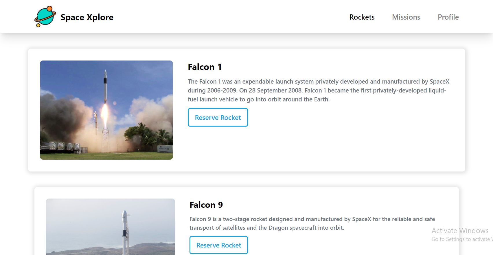
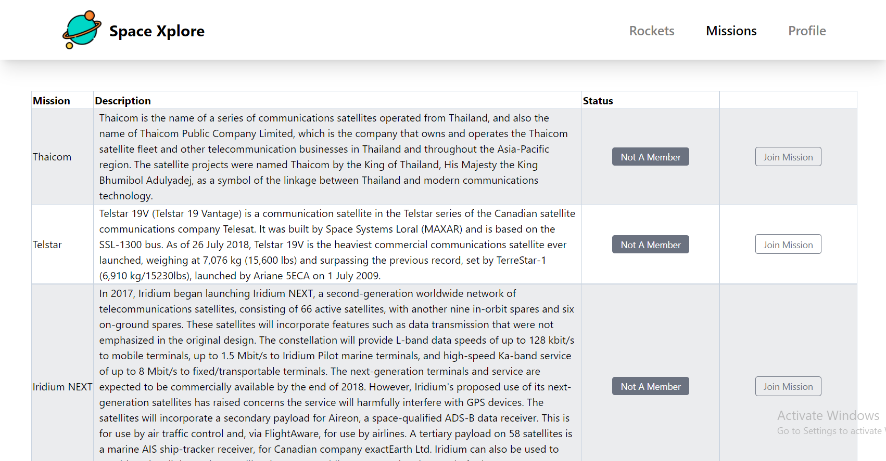

# Space Xplore
## Description
Space Xplore is a React-Redux application that features 3 pages Rockets, Missions, and the My Profile. it that allows you to:

- See different Rockets and reserve anyone.
- See different Missions and Join anyone.
- Display your reserved rockets and joined missions in the profile section.

## 🚀 Live Demo

The live demo [link](https://space-xplore.netlify.app/) deployed on Netlify.

## Video Demo

Video Demo [Link](https://drive.google.com/file/d/1MFIgsDCAyO6s45lenErA36nYgRwH3bFy/view?usp=sharing)

## Site Screenshots

## 🛠 Built With

### Tech Stack

- React.
- JavaScript.
- Redux
- Tailwind.
- Linters.

### Key Features

- Gitflow workflow is used.
- GitHub Projects (Kanban board Agile) is used to arrange workload between team members.
- App created using CRA (create-react-app).
- REST API consumed to fetch rockets, and missions.
- Redux is used as a state management tool.
- Tailwind is used for styling.

## 💻 Getting Started

### Prerequisites

- Install [node.js](https://nodejs.org/en/).
  
### Setup

- Clone the project using git-bash or Githup Desktop.
- Open the project folder with VSCode or any Editor.
- Open the terminal and navigate to the project folder.

### Usage

- Run this command `npm install` to install dependencies.
- Run this command `npm start` to start the dev server.

### Test

- `Npm run test`

## Authors

👨‍💻 **Omar Muhammad**

- GitHub: [@Omar-Muhamad](https://github.com/Omar-Muhamad)
- Twitter: [@Eng_OmarMuhamad](https://twitter.com/Eng_OmarMuhamad)
- LinkedIn: [@eng-omarmuhammad](https://www.linkedin.com/in/eng-omarmuhammad/)

👤 **George Magdy**

- GitHub: [@George_Magdy](https://github.com/gemmen29)
- Twitter: [@George_Magdy](https://twitter.com/georgtriple1)
- LinkedIn: [@George_Magdy](https://www.linkedin.com/in/george-magdy-840/)

## 🤝 Contributing

Contributions, issues, and feature requests are welcome!

Feel free to check the issues page.

## ⭐️ Show your support

Give a ⭐️ if you like this project!

## 📝 License

This project is [MIT](./MIT.md) licensed.
