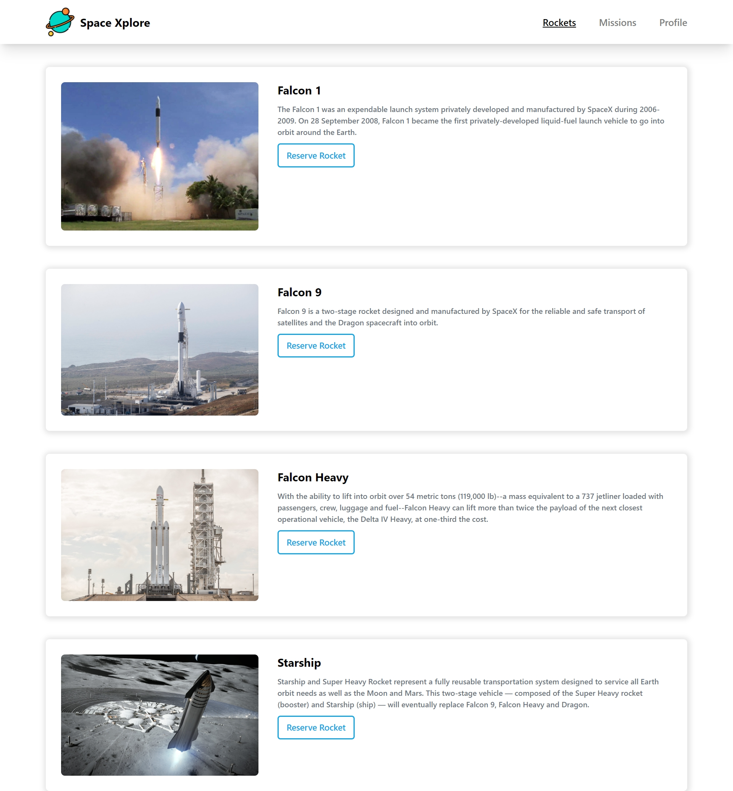
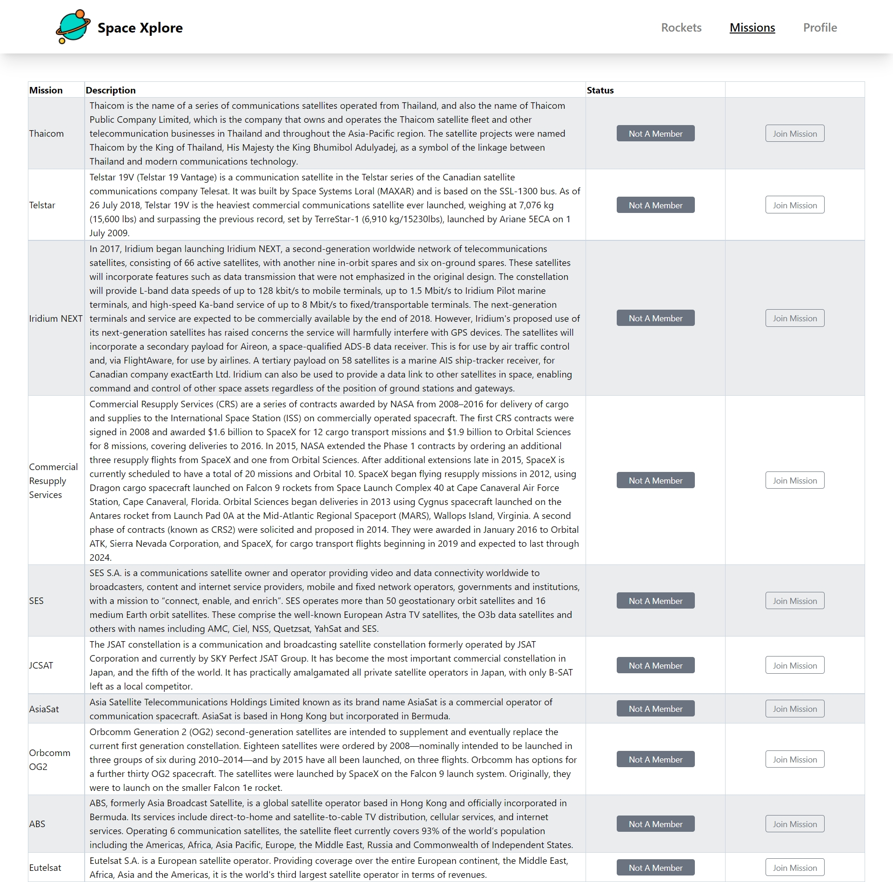

# Space Xplore

## Description

Space Xplore is a React-Redux application consists of Rockets, Missions, and the
My Profile section. it that allows you to:

- See different Rockets and reserve any one.
- See different Missions and Join any one.
- Display your reserved rockets and joined missions in profile section.

## Live Demo

This is the live demo [link](https://space-xplore-500.netlify.app/) to our site.

## Video Demo

Video Demo
[Link](https://drive.google.com/file/d/1MFIgsDCAyO6s45lenErA36nYgRwH3bFy/view?usp=sharing)

## Site Screenshots

# Full Website

 

## Built With

- React.
- Redux
- HTML.
- CSS.
- JavaScript.
- Tailwind.
- Linters.

## Install

- Install node.js from [HERE](https://nodejs.org/en/).

## Test

- `Npm run test`

## Setup

1. Clone the project using git-bash or Githup Desktop.
2. Open the project folder with VSCode or any Editor.
3. Open terminal and navigate to the project folder.
4. Type `npm install`.
5. Type `npm start`.

## Authors

👨‍💻 **Omar Muhammad**

- GitHub: [@Omar-Muhamad](https://github.com/Omar-Muhamad)
- Twitter: [@Eng_OmarMuhamad](https://twitter.com/Eng_OmarMuhamad)
- LinkedIn: [@eng-omarmuhammad](https://www.linkedin.com/in/eng-omarmuhammad/)

👤 **George Magdy**

- GitHub: [@George_Magdy](https://github.com/gemmen29)
- Twitter: [@George_Magdy](https://twitter.com/georgtriple1)
- LinkedIn: [@George_Magdy](https://www.linkedin.com/in/george-magdy-840/)

## Show your support

Give a ⭐️ if you like this project!

## 📝 License

This project is [MIT](./MIT.md) licensed.
